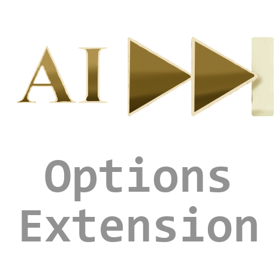

# Fast Forward AI Turns -- Options Extension

## General
This is an extension to Fast Forward AI Turns https://steamcommunity.com/sharedfiles/filedetails/?id=1787443465, which allows anyone to customize the settings of how the mod will behave in certain conditions

With quick combat disabled in your options, this mod allows you to customize 5 distinct settings, with some granularity each.

1) Human Player being attacked, 2) Alliance Member defending from an attack, 3) Alliance Member attacking an enemy, 4) a City-State that you are the Suzerain of being attacked, and 5) a City-State that you are Suzerain of attacking.
Each of these have a toggle that handles all scenarios, and then the ability to specify if you want the slow combat to only handle in unique cases, such as if a different AI is attacking/defending, if the barbarians are attacking/defending, or if a city-state is attacking/defending. The more granular options will only be used if the all toggle is set to false.

**Modifying the Values:**
1. Navigate to your Steam Install Directory (By Default: C:\Program Files\Steam\steamapps\workshop\content)
2. Search for "Zug_FastForwardAI_ModSettings.lua" and open in Text.
3. Change the values inside "BattleSettings" only.
4. Modify the values according to preference. Values must be "false" or "true" (without quotes). If the top option of the section is set to true, all other options will be ignored.

Extension:
If you want to change your options to allow for specifying when the attack animations should be quick or not when it is not your turn, you can download the Options Extension to specify what you prefer.
https://steamcommunity.com/sharedfiles/filedetails/?id=2031824982

## Download
### Steam
https://steamcommunity.com/sharedfiles/filedetails/?id=2031824982

## License
This project is licensed under MIT. Refer to the [LICENSE](./LICENSE) for more details

This repository is not created by, affiliated with or sponsored by Take-Two Interactive Software and its subsidiaries or its affiliates.